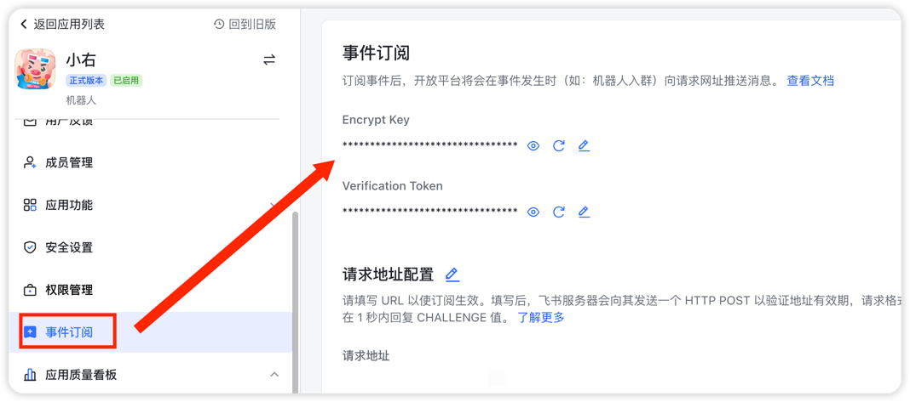
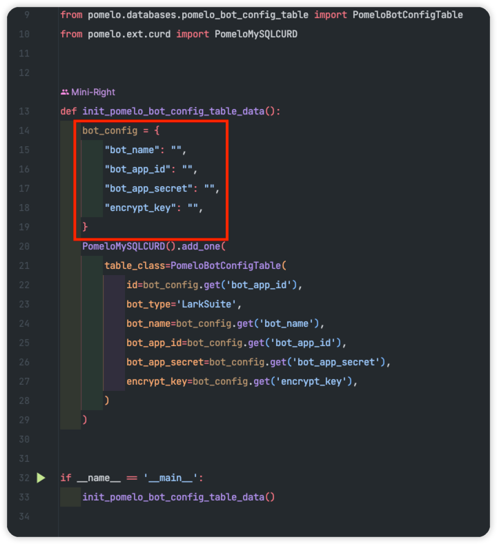
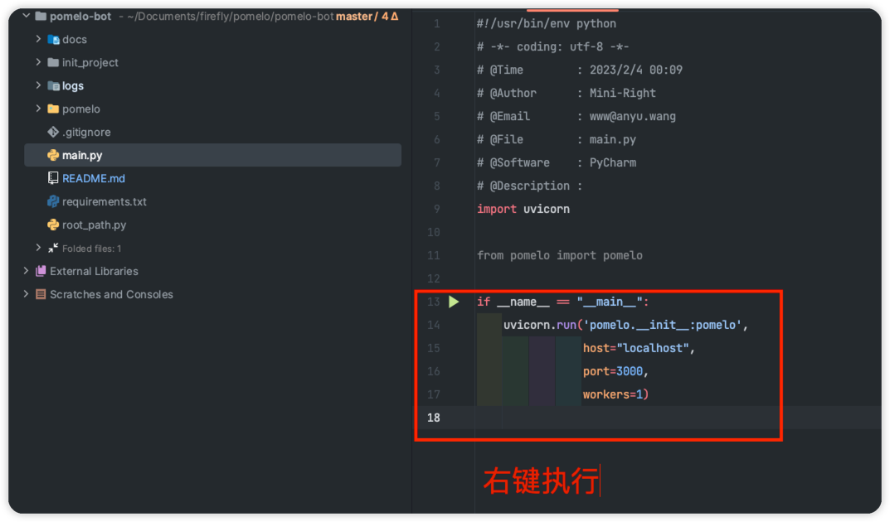

## 简介
基于`FastAPI`开发的飞书自建应用(机器人)通用脚手架，支持多应用对接。

## 技术栈
`FastAPI` + `uvicorn` + `SQLAlchemy`

## 食用方法
### 环境搭建
`pip3 install -r requirements.txt`

### 配置修改
1. 修改`pomelo/config/dev.toml`和`pomelo/config/prod.toml`中MySQL/Redis配置
2. 获取飞书应用的`App ID`、`App Secret`、`Encrypt Key`
  
  
3. 将`App ID`、`App Secret`、`Encrypt Key`添加到`init_project/init_bot_config.py`，执行方法
  

### 项目启动
#### 本地调试

### 服务器运行
`uvicorn main:pomelo --host 0.0.0.0 --port 3000 --workers 1`

## 功能描述
|   功能点   | 状态 |
| :--------: | :--: |
| 多应用接入 |  ✅   |
|  事件订阅  |  ✅   |
|  卡片回调  |  🏃   |

|      事件订阅      | 状态 |
| :----------------: | :--: |
|     机器人进群     |  ✅   |
|     机器人退群     |  ✅   |
|      接收消息      |  ✅   |
|   消息被reaction   |  ✅   |
| 消息被取消reaction |  ✅   |
